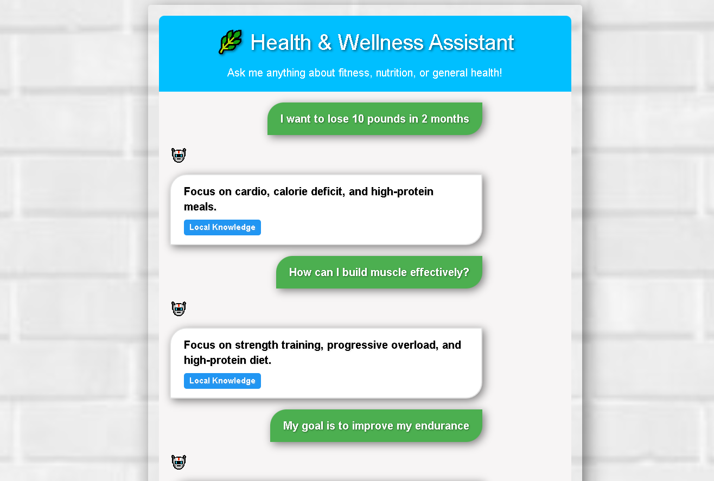
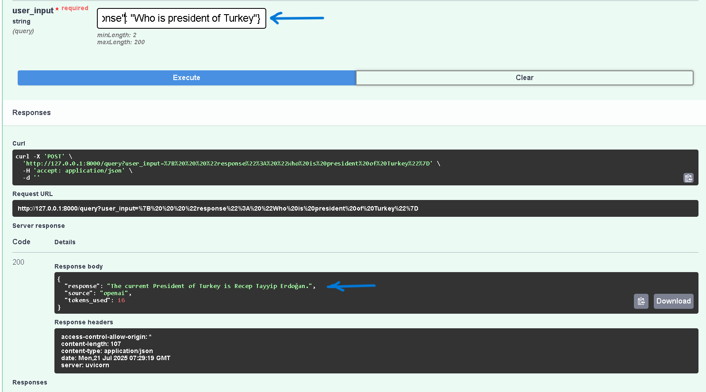

1-NextJs Frontend Chat Bot:



2-API Backend Chat Web Page:




# Health-Wellness-Agent2-With-Frontend-Bakend-Complete

## Backend

# 🧠 Health & Wellness Agent2 (Backend)

This is the backend for the **Health & Wellness Assistant**, built using **FastAPI** and enhanced with OpenAI for intelligent responses when local logic can't handle the query. It powers the frontend chat interface, delivering real-time fitness, nutrition, and wellness advice.

> 🌐 **Live API**:
> 🔗 [Backend URL](https://health-wellness-agent2-backend.onrender.com)
> 🔧 [Swagger Docs](https://health-wellness-agent2-backend.onrender.com/docs)

---

## ⚙️ Technologies Used

- 🐍 **Python 3.11+**
- ⚡ **FastAPI** – For async API endpoints
- 🔐 **OpenAI** – For AI-powered fallback answers
- 📦 **Pydantic** – Data validation
- 🧪 **Uvicorn** – ASGI web server
- 🌍 **CORS** enabled for full frontend-backend communication
- 🔐 **python-dotenv** – For secure API key management

---

## 📁 Project Structure
health_wellness_agent/
├── main.py # CLI chatbot interface with fallback logic
├── fast_api.py # FastAPI server exposing /query endpoint
├── agent.py # Core logic for health query handling
├── context.py # Session-based memory handling
├── guardrails.py # Input/output sanitization (optional)
├── requirements.txt # All dependencies
├── tools/ # Modular health tools (e.g. BMI, hydration)
└── agents/ # Specialized sub-agents

---

## 🔌 API Endpoints

### `GET /`
Returns service status and local documentation hint.

### `POST /query?user_input=...`
Handles a health query. First tries local logic. If not understood, falls back to OpenAI.

#### Example Response:
```json
{
  "response": "Drink at least 2-3 liters of water daily.",
  "source": "local",
  "tokens_used": null
}

```
#### If OpenAI is used:
```
{
  "response": "Include more fiber and vegetables in your diet.",
  "source": "openai",
  "tokens_used": 43
}

```
---

🧠 How It Works
Local Response First:
The HealthWellnessAgent checks if the query matches known health rules.

OpenAI Fallback:
If no local logic applies, it calls GPT-3.5-Turbo with strict formatting guidelines:

Short, clear facts

No medical diagnoses

Uses bullet points when instructional

Always recommends consulting a doctor for uncertain topics

Source Tagging:
Each response tells you if it came from "local" or "openai".

🖥️ Run Locally
1. Clone the Repo
git clone https://github.com/yourusername/health-wellness-backend.git
cd health-wellness-backend

2. Set Up Environment
Create a .env file:
OPENAI_API_KEY=sk-xxxxxxxxxxxxxxxxxxxxxxxxxxxxxxxxxxxx


3. Install Dependencies
pip install -r requirements.txt

4. Run Server
uvicorn fast_api:app --reload

🔗 Visit http://127.0.0.1:8000/docs for Swagger UI
📡 CORS is enabled, so your frontend can connect seamlessly

🚀 Deployment (Render)
Push your code to GitHub.

Log into Render

Create a new Web Service:

Environment: Python 3

Start command: uvicorn fast_api:app --host 0.0.0.0 --port 10000

Add environment variable: OPENAI_API_KEY

Deploy and grab your public backend URL.

💡 Features
✅ Local + AI fallback logic
✅ OpenAI token tracking
✅ Bullet-format answers when instructional
✅ Works seamlessly with any frontend (React, Next.js, etc.)
✅ CLI chatbot for testing
✅ Error messages with full traceback for debugging

📦 requirements.txt
fastapi==0.100.1
uvicorn==0.23.2
openai==1.93.0
pydantic==2.11.5
python-dotenv==1.0.1


🤝 Connected Frontend
🔗 Frontend GitHub Repo
💬 Built with Next.js & TypeScript

🙏 Acknowledgements
Developed with ❤️ by Azmat Ali
Powered by FastAPI, OpenAI, and Render
Secure API communication via .env
Connected to a responsive chat frontend

🧪 Try the API
Example via curl:
curl -X POST "https://health-wellness-agent2-backend.onrender.com/query?user_input=how to lose weight"


📜 License
This project is for educational and informational use only. Always consult a professional for medical guidance.

🌍 Result:
Your backend (FastAPI) runs on Render ✅
Your frontend (Next.js) runs on Vercel ✅
User opens frontend → It talks to live backend → AI gives response ✅

🎯 Goal
Keep fast_api.py always online (as backend API)
Deploy Next.js frontend that communicates with the backend
Ensure both work even after system restart
# -------------------------------------------------------------
 Goal Setting Questions:
 "I want to lose 10 pounds in 2 months"
 "How can I build muscle effectively?"
 "My goal is to improve my endurance"
 Meal Plan Questions:
 "Can you suggest a vegetarian meal plan?"
 "I need gluten-free meal ideas"
 "What's a good vegan diet for weight loss?"
 Workout Questions:
 "Recommend a cardio workout routine"
 "Suggest strength training exercises"
 "What's a good HIIT workout?"
 Combination Questions:
 "I want to lose weight - suggest meals and workouts"
 "Help me build muscle with diet and exercise plans"
 General Health Questions:
 "What are some healthy breakfast options?"
 To Exit:
 Type "exit" or "quit" at any time
 The assistant will:
 Analyze your goals
 Provide personalized meal plans
 Recommend suitable workouts
 Maintain context during your conversation

# -------------------------------------------------------------

Prepared By : Azmat Ali Akbar

# -------------------------------------------------------------
Press Ctrl + Shift + P → type Python: Select Interpreter
https://health-wellness-agent2-backend.onrender.com/

https://health-wellness-agent2-backend.onrender.com/docs

## Frontend

# 🌿 Health & Wellness Assistant (Frontend)

This is the frontend for the **Health & Wellness Assistant** project, built using **Next.js** and deployed on **Netlify**. It connects to a Python-based **FastAPI backend** hosted on **Render** to provide intelligent responses about fitness, diet, and wellness.

---

## 📁 Project Structure
📦 health-wellness-frontend
├── pages/
│ ├── api/
│ │ └── chat.ts # API route to communicate with FastAPI backend
│ └── page.tsx # Main chat interface page
├── public/
│ └── h2.png # Health bot image
├── styles/
│ └── HealthChat.module.css # CSS styles for the chat interface
├── types/
│ └── index.ts # TypeScript interfaces
├── .env.local # Environment variable to store backend URL
├── README.md # Project documentation
└── globals.css # Global CSS styles


---

## 🚀 Deployment Links

- 🔗 **Frontend (Next.js on Netlify)**: [🌐 Visit Site](https://your-netlify-app-url.netlify.app)
- 🔗 **Backend (FastAPI on Render)**: [🌐 API Endpoint](https://health-wellness-agent2-backend.onrender.com)

---

## ⚙️ Technologies Used

- **Next.js 13+ (App Router)**
- **TypeScript**
- **CSS Modules**
- **FastAPI (Python backend)**
- **Render (Backend Deployment)**
- **Netlify (Frontend Deployment)**

---

## 📡 How It Works

1. The user types a health-related question into the chat interface.
2. The frontend sends a `POST` request to the internal API route `/api/chat`.
3. This route fetches the response from the FastAPI backend via:

NEXT_PUBLIC_BACKEND_URL/query?user_input=...

4. The backend processes the request using local or OpenAI-based logic and returns a structured response.
5. The frontend displays the bot's reply in a styled chat interface, along with:
- 🔹 Source: "Local Knowledge" or "AI Generated"
- 🔸 Token count (if AI was used)

---

## 💡 Features

✅ Real-time health assistant
✅ Attractive and friendly UI
✅ Fully responsive for all screen sizes: **mobile, tablet, and desktop**
✅ Source tagging (local/AI)
✅ Error handling and typing indicators
✅ FastAPI backend integration via environment variable

---

## 🌐 Mobile & Responsive UI

📱 This frontend was designed with mobile-first principles and tested on:
- Android and iOS phones
- Tablets
- Laptops and desktops

💡 The layout adapts gracefully with clean fonts, spacing, and responsive chat elements.

---

## 📦 Environment Variable

To communicate with the backend, create a `.env.local` file with this content:

```env
NEXT_PUBLIC_BACKEND_URL=https://health-wellness-agent2-backend.onrender.com

✅ This ensures backend URL can be accessed securely in the frontend.
```
## To run the app locally:

## 1. Clone the repo
git clone https://github.com/yourusername/health-wellness-frontend.git
cd health-wellness-frontend

## 2. Install dependencies
npm install

## 3. Set up environment
touch .env.local
# Add the backend URL in .env.local

## 4. Run the app
npm run dev
# ---------------------------------------------

## 🌍 Deployment Process
✅ Netlify Steps:
Push your frontend code to GitHub.

Log in to Netlify.
Select "New site from Git" and connect your GitHub repository.
Set build command: npm run build
Set publish directory: out or .next
Add environment variable: NEXT_PUBLIC_BACKEND_URL
Click Deploy Site

✅ Site will be auto-redeployed on every Git push.


## ✨ Special Note
This frontend integrates seamlessly with our intelligent FastAPI backend to provide:

## 📋 Health tips
## 🏃‍♂️ Exercise advice
## 🥗 Nutrition plans
## 🤖 AI-based responses (when needed)

Designed to give users a smooth and helpful experience across all platforms.

## 🙏 Acknowledgement
Developed with ❤️ by Azmat Ali
Connected to Python backend via API
Deployed using Render & Netlify

## Check Backend url

https://health-wellness-agent2-backend.onrender.com/
https://health-wellness-agent2-backend.onrender.com/docs